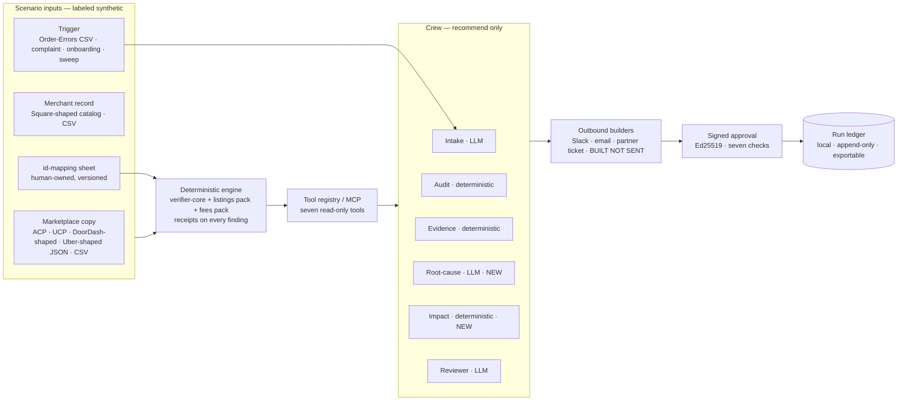

# Plan — Menu Integrity Crew (goal re-fixed 2026-10-09)

**Status (2026-10-09, session 48, Fable 5.1 in Cursor as orchestrator/evaluator):** PLAN WRITTEN, AWAITING OWNER GO. Nothing built. This document is the approval artifact, in the shape of `docs/plan-testable-instrument-2026-09-01.md`.
**Owner words (verbatim, 2026-10-09, four messages):** *"we have to deliver to the pilot project as a working demo to the companies such as doordash, uber."* · *"these companies want to deliver a ai agent or multi agent product or ai automation or ai product to deliver these companies something resolves their real use case or pain point … i wont be running continuously, may be have test data to test it and showcase it how it would work."* · *"also governance model, aspect, real specific business delivery point is needed effect and after. it could be tangible or non tangible or both, including the cost -benefit as well."* · *"I have gemini subscription also look for free open source equally model as well … it is only US … have clear setup, organised, structure, framework, methodologies, efficient … these floor not ceiling, use own judgement to build also document once we are approved. i have separate claude cli subscription that could utilize your work … the manual liason would be me pasting the prompt back and forth."*
**Basis:** the 2026-10-09 end-to-end evaluation (session 48, in `CURRENT_TASK.md`): engine and evidence discipline are pilot-grade; the data path, menu model, audience framing and deployment state are not. Live-verified today: both named platforms run agentic ordering, both state the menu-truth pain in their own integration docs, and the UCP Food Technical Council (Block/Square · DoorDash · Google · Toast · Uber Eats, seated 2026-07-16) has published no food schema yet.
**Process:** full loop (new audience · public claims · AI behavior · data-model change). Owed before the direction is treated as decided: a Codex cross-check (owner-shell). `RULES.md` §4 unchanged: simulated data always; never a real-platform, real-merchant or real-impact claim.

---

## 1 · The goal, fixed

> **Curbside Commons becomes the Menu Integrity Crew: a human-gated multi-agent workflow a US delivery platform's Merchant-Ops / Agentic-Commerce team would run to catch, explain, size and route drift in the platform's copy of a merchant's menu — before it becomes a refund, an error-charge dispute, a cancelled agent order, or a partner-quality enforcement. It runs on demand on a labeled scenario library, with recorded model turns by default and owner-armed live models when shown live. Deterministic engine decides; agents recommend; a human signs anything that would act. US only. Desktop and tablet.**

**What "done" means** (declarative; each line names its test in § 12):

1. A platform reviewer can pick any of eight scenarios on the live site or the CLI, run it, and see: verdict with receipts → root cause → impact → routing → the three outbound artifacts (built, not sent) → the signed approval → the ledger entry.
2. Every figure shown is derived from the scenario data by code and held equal to an engine run by a test; none is typed.
3. Every LLM seat carries a label earned on a pre-registered floor, per model; a seat on a model that has not sat its exam renders DEFER.
4. Zero egress holds for the whole crew path in replay mode; the live path is gated by `ENABLE_LIVE_AI` and a key, budget-capped, and never reachable from the public site.
5. The governance model and the business delivery point exist as repo documents and a `/pilot` page, and the C10 gate is green over every new sentence.
6. The two-seat workflow (Fable orchestrates and reviews · Claude Code CLI builds · owner liaises) has produced at least one slice end to end with its return packet on record.

## 2 · Scope

- **Geography:** United States only. Legal pack stays NYC §20-563.3 (built); SF's permanent 15 % cap is a registered follow-on, not in this plan. US-shaped money (USD, cents), US POS and marketplace shapes.
- **Audiences, split by incentive:** (A) **platform / sync-vendor** — feed truth, conformance, agent pre-flight, partner scorecard (cooperative with the platform); (B) **merchant / association / regulator** — the fee audit (adversarial to the platform). The platform deck never leads with (B). Both decks ship; (A) is the pilot.
- **Out of scope, by decision:** live sends · any Tier-2/3 action (§ 6) · fuzzy id matching as a default · a phone tier · a hosted service · re-attempts of E2/E4 · redesign of anything owner-fixed in `DESIGN.md`.

## 3 · The pain, verified today (dated; primary where it matters)

- DoorDash × Gemini agentic ordering beta launched 2026-03-03; DoorDash app inside ChatGPT since 2025-12; Uber in the same Gemini program (Chain Store Age 2026-02-26; Retail TouchPoints 2026-03-03).
- DoorDash Preferred Integrations criteria: "real-time menu syncing — menu updates, pricing, and **modifiers**", real-time 86'ing, "detailed order error reporting"; help center: complex modifiers and inaccurate descriptions drive accuracy errors, clear menus cut them 20–50 % (merchants.doordash.com; help.doordash.com, read 2026-10-09).
- Uber Eats integration quality program: 99 % injection-success floor or API revocation; Menu Maker edits overwrite API menus; merchants download an **Order Errors CSV** (issue type, item in error, refund, merchant charge, Uber-absorbed amount) (developer.uber.com; merchants.ubereats.com, read 2026-10-09).
- UCP: current release `v2026-08-25` (repo pins `2026-04-08`); Food TC seated 2026-07-16; Phase 2 = menu catalog + modifier tree; **no food schema published** (ucp.dev announcements; github.com/Universal-Commerce-Protocol/ucp release + discussion #593).
- FTC food-delivery-fee rulemaking: ANPRM 2026-04-16, comments closed 2026-05-18 (438), **no NPRM** as of today (federalregister.gov; ftc.gov).
- **Corrected 2026-10-09 (second research pass, § 16):** merchant-side menu monitoring is NOT empty (Prestau, Kitchain, Deliverect Sentinel, VooshGPT); the open seat is the independent, evidence-grade, agent-aware, platform-side verifier with a human-gated crew. Copy must never say "nobody audits menus."
- **Still unvalidated:** that a platform would buy this rather than build it. Five conversations (one platform integrations PM, two sync-vendor engineers, two operators) are S5, before outreach.

## 4 · Architecture — what stands on what



Layer rules, unchanged from the repo's doctrine: the engine never imports a model or the network (import-graph tooth); the crew reaches the engine only through the registry; builders cannot send; the approval flow is the only path to a recorded "action"; the ledger is the audit trail.

## 5 · The agent roster

| Seat | Kind | Reads | Produces | Label regime |
| --- | --- | --- | --- | --- |
| Intake | LLM (exists; floors cleared 2026-07-07) | the trigger + scenario brief | which tool to run, scoped | agent (live-run floors cleared) · DEFER on an un-examined model |
| Audit | deterministic (exists) | feed · record · map | the verifier report | deterministic workflow |
| Evidence | deterministic (exists) | the report | receipts bundle, report hash | deterministic workflow |
| **Root-cause** | LLM (NEW) | findings + timestamps + source metadata | one of {sync-latency, merchant-edit, integrator-bug, platform-override, encoding, unknown} + a cited reason | advisory; pre-registered floors (per-class recall ≥ 0.80, zero unsafe class flips across K=3, beats a deterministic timestamp baseline) · never gates |
| **Impact** | deterministic (NEW) | findings + scenario order velocity | orders at risk · refund $ · error-charge exposure · agent-cancel exposure, with the arithmetic | labeled simulated; every number derived |
| Reviewer | LLM (exists; floors cleared) | all of the above | route (merchant-ops · partner · compliance) + which artifacts + escalate/propose | agent (live-run floors cleared) |
| Approval | human, signed (exists as simulator) | a proposal bound to the run digest | a signed decision or a refusal | the only path to "executed = recorded" |

Why two new seats and not more: root-cause is the question an ops person actually asks and no deterministic rule can answer it in full; impact is what turns a finding list into a reason to act. Everything else a platform needs already exists.

## 6 · Governance model

**Decision rights.** The engine decides verdicts (versioned rule tables, byte-reproducible, no clock, no model). Agents recommend (separate envelope; cannot flip a verdict; labels earned per model on pre-registered floors). Humans approve (Ed25519-signed, role-bound, content-bound, replay- and expiry-checked). The platform governs rule changes through change control (the drift-lock already fails the build when code and rulebook disagree; add a dated freshness check and a named approver).

**Action tiers** (the catalog a risk team asks for; the pilot stops at Tier 1):
- Tier 0 · notify — Slack / email / partner-ticket artifacts. Built; a transport, if ever wired, is per-channel, allow-listed, owner-armed.
- Tier 1 · propose — 86 an item · force re-sync · hold an item on the agent surface · open a partner ticket. Proposed with receipts and impact; requires a signed human decision; "executed" = a ledger record.
- Tier 2 · act on a completed, human-approved audit — e.g. calling a platform API to 86 an item. Permitted in principle by `docs/decisions/crew-acts-2026-07-26.md`; out of scope here; never from inside an audit.
- Tier 3 · never — amend a merchant record · issue a credit · file a dispute or complaint on anyone's behalf.

**Control register** (exists → to add):
- Evidence: claim · reference row · rule id · severity on every finding, enforced by construction. → add: the id-mapping sheet is cited as a reference row when it resolves an identity.
- Model risk: per-seat model pin · budget guard fail-closed · injection tripwire before any model turn · report-hash pin when a model touched the run · eval-locks. → add: `docs/model-risk-register.md` (seat · model · version · floors · last exam date · owner · DEFER state) and a re-exam rule on any model change (§ 8).
- Data: nothing leaves the tab/machine, proven by import-graph tests. → add: a data-classification sheet for pilot inputs; an ingest rule that drops any customer field from a platform export, with a test; a retention rule (local ledger, platform-owned, deletable); a one-page data-handling statement.
- Audit trail: → add the run ledger (inputs hashed · rule versions · model versions · recommendations · signer · timestamp), exportable as JSON-lines.
- Operational: manual trigger only, no scheduler, no standing process. → add: incident/rollback note (a wrong recommendation is withdrawn by a signed counter-decision, never edited) · escalation path · RACI across merchant-ops / integrations / compliance.

**Pilot governance.** Scope document (use case, scenarios, teams, in/out, four weeks on test data then two on the platform's own exports inside their environment) · pre-registered success metrics written before the pilot runs · data-request spec · security packet (zero-egress proof, dependency list, Apache-2.0, no telemetry) · weekly readout · exit criteria for "expand" and "stop" · honesty carried into the room (synthetic labeled; platform-shaped inputs labeled "shaped like the public integration docs, not from the platform"; no affiliation claim).

## 7 · The business delivery point, effect and after

**The point:** drift in a platform's copy of a merchant's menu is caught, explained, sized and routed before it becomes a refund, an error-charge dispute, a cancelled agent order, or a partner-quality enforcement — with an audit trail.

**Before (per the platforms' own docs):** errors are discovered after the customer reports them; refunds are issued and clawed back from merchants as error adjustments, with disputes on both sides; menu accuracy is managed by advice to merchants and by integration thresholds enforced by sampling; an agent reads whatever the copy says.

**After:** a sweep or trigger runs the crew; each wrong price, missing modifier, phantom or 86'd item is named with receipts; root cause says why; impact says how much is at risk; the reviewer routes it with a drafted artifact; a human signs the fix; the ledger records it. For agent orders: a pre-flight on the item an agent is about to order confirms or holds it.

**Tangible, measured before vs. after with the platform's own instruments:** order-error adjustments per 1,000 orders and the refund dollars behind them (the Order Errors report is the baseline instrument) · dispute volume and handling minutes per merchant-month · agent-order cancellation rate on flagged vs. unflagged items · time-to-detect drift · partner-enforcement hours per partner-quarter.

**Intangible:** merchant trust and retention · regulatory posture (a run ledger is the recordkeeping the NYC DCWP docket and the FTC inquiry point toward) · agent-surface credibility with Google and OpenAI · standards position when the UCP Food schema lands.

**Cost-benefit — the model; every number sourced or declared.**
Benefit/month ≈ orders × error rate × menu-data share × avg refund × measured catch rate + dispute minutes avoided × loaded hourly cost + agent cancellations avoided × their cost.
Illustrative fill (synthetic assumptions, replaced by the platform's export on day one): 1,000 stores × 30 orders/day × 30 days = 900,000 orders; error rate 1.5 %; menu-data share 40 % → ~5,400 drift-caused errors; avg refund $20 → ~$108,000/month of refund flow exposed to this class, before the catch rate. Anchors: DoorDash's own 20–50 % menu-clarity effect; the vendor-sourced "2.5–3 % of revenue in disputes" (labeled vendor-sourced in `docs/research/pivot-research-2026-07.md`); NYC's $580K restitution to 380 restaurants (~$1.5K each) for fee-side scale.
Cost: build to showable demo three to four weeks on the existing engine · run cost $0 in replay, cents per live run under the existing $5 guard on free tiers · platform-side cost = one menu export, one record export or POS read, an id-mapping sheet, reviewer minutes per batch; no security integration because nothing leaves their environment.
**The one pre-registered pilot number:** a measured reduction in menu-data-caused order-error adjustments on the pilot cohort vs. baseline, floor written before the pilot runs.

## 8 · Model strategy (verified 2026-10-09; re-verify at use-time, RULES §6)

Four tiers; the showcase runs Tier A unless the owner arms a live tier for a live demo.

| Tier | What | Cost | When |
| --- | --- | --- | --- |
| **A · Replay** (default) | recorded model turns committed per scenario; the crew evals already run this way | $0, offline, deterministic | every showcase; CI; the public site |
| **B · Hosted open-weight** | Groq free tier (no card): `openai/gpt-oss-120b` (the seats' floors were earned here), `gpt-oss-20b`, `qwen/qwen3.8-27b`; 30 RPM · 1K RPD · 8K TPM · 200K TPD | $0 | live demo of a seat; new exams |
| **C · Gemini** (cross-family judge / alternate drafter) | AI Studio free tier: `gemini-3.8-flash`, `gemini-3.5-flash-lite`, `gemini-3.1-flash-lite` (free input/output; content may be used by Google — synthetic only, so acceptable). Paid 3.8-flash $0.75 / $3.75 per 1M through 2026-12-31. **The owner's Google AI Pro plan does not fund AI Studio keys** (prepaid, $5 minimum); it does carry **$10/month Cloud credit usable via Vertex AI** — the fallback if free-tier limits bite. | $0 (free tier) · ≤ $5 total hard cap retained | maker≠judge cross-family checks; a second drafter for consistency runs |
| **D · Local open-weight** | Ollama with JSON-schema `format`, temperature 0: `gpt-oss:20b` (Apache-2.0, 128K, needs 16 GB — same family as Tier B so floors transfer with a re-exam) or `qwen3:8b` (8 GB). Owner picks by `sysctl -n hw.memsize`. | $0, air-gapped | the "runs inside your environment" security story; offline live demos |

Freshness findings to act on in S1: Vercel's current guidance targets **AI SDK 7** (repo on `ai` ^5) — assess the upgrade path and record it, do not upgrade blind; `lib/agents/pricing.ts` pins `gemini-2.5-flash` / `-lite` (2026-06-18) — Google now restricts 2.5 to prior users and names 3.5 Flash-Lite / 3.8 Flash for new projects → re-pin to `gemini-3.5-flash-lite` (default, cheapest) with `gemini-3.8-flash` as the override, prices re-pinned, `PRICING_VERSION` bumped, preflight `models.list` kept. UCP pin `2026-04-08` → `v2026-08-25` (schemas re-vendored with provenance; the Food vertical watched as a re-check trigger).

**Exam rule (unchanged discipline):** a seat's label is per (seat, model). Changing the model means a fresh pre-registered split (generated from the scenario library, never a reused one), floors committed before the run, raw turns frozen, score re-derivable. A seat without a passed exam on the active model renders DEFER on its face.

## 9 · The scenario library (the test data)

`fixtures/scenarios/<id>/` — `brief.md` (the story a reviewer reads) · `inputs/` (feed · record · map · trigger) · `expected/` (report · root-cause · impact · route · artifacts · ledger entry) · `turns/` (recorded model turns per seat per model) · `manifest.json` (provenance, labels, seed). Freeze-locked and regenerable from seed like every fixture here. All synthetic; platform-shaped inputs carry `"shapedLike": "<platform> public integration docs"` and the C10 gate gains probes for any affiliation phrasing.

1. **agent-86** — an agent order cancelled on an 86'd item the copy still showed.
2. **modifier-drift** — a modifier price +$1.50 in the record, +$2.00 on the copy, across 40 orders.
3. **sync-outage** — a whole category stale for 36 hours after a sync-vendor outage.
4. **platform-override** — a platform-side manual edit overwrote the API menu.
5. **partner-onboarding** — a new integration partner's feed scored against the published quality criteria.
6. **spec-valid-lie** — a UCP response that passes conformance and lies about price (the existing exhibit).
7. **fee-precheck** — a fee statement pre-checked against NYC §20-563.3 for the platform's legal team (the demoted fee pack).
8. **injected-artifact** — a prompt-injected artifact tries to steer the crew (the existing injection case).

Plus one realistic-scale fixture under `fixtures/synthetic-restaurant-large/`: ~300 items with modifier groups, a 7-day drift series, a month of orders — the source of the impact arithmetic and the drift-over-time view.

## 10 · Methodology and frameworks (what we hold ourselves to)

- **Pre-registered floors, eval-locks, burned splits** — for every LLM seat, per model (existing).
- **TDD red-green with mutation proof** — every slice ships the test first, proves it bites, and records the mutation that turned it red (existing practice; `docs/quality/mutate.py`).
- **Derived figures only** — any number a reader sees is a field computed from fixtures and held equal to an engine run (`lib/landing/test-guide.ts` pattern, extended to scenarios and the pilot page).
- **Freeze-locked fixtures, import-graph egress teeth, C10 honesty gate, declared denominators** (existing).
- **Replay by default, live by owner word** — the showcase never depends on a network.
- **Two-seat build** (§ 13) — plan and review here; build in Claude Code CLI; one slice per dispatch; the orchestrator re-runs the gates on the shared working tree before anything is called done.
- **Documentation standard** — plain-English first, technical alongside (`docs/documentation-standard.md`); `docs/PLAIN-ENGLISH.md` updated per stage.
- **Archive, don't raise** — the startup docs are at 233,855 / 250,000 bytes; S0 archives closed session blocks before new ones are written.

## 11 · Setup (clear, organised)

- **Runtime:** Node ≥ 24 · `npm ci` · `npm run verify` · `node bin/check.mjs demo` · `npm run walkthrough` · `npm run mcp`. New: `node bin/check.mjs scenario <id> [--live]` · `node bin/check.mjs ledger diff <run-a> <run-b>`.
- **Env (all optional; absent = replay):** `ENABLE_LIVE_AI` · `GROQ_API_KEY` · `GEMINI_API_KEY` · `GEMINI_MODEL` · `OLLAMA_HOST` (new, Tier D) · per-seat `*_MODEL` overrides. Never committed; `.env.example` is the template.
- **Repo layout additions:** `lib/crew/seats/root-cause.ts` · `lib/crew/seats/impact.ts` · `lib/delivery/partner-ticket.ts` · `lib/ledger/` · `lib/packs/listings/adapters-platform/` (DoorDash-shaped · Uber-shaped · Order-Errors CSV) · `lib/packs/listings/modifiers.ts` · `fixtures/scenarios/` · `app/pilot/page.tsx` (outside the nav) · `docs/governance-model.md` · `docs/model-risk-register.md` · `docs/pilot-kit/`.
- **Where things run:** site = static export, in-browser engine, replay only · CLI/MCP = local, replay or live by env · exams = owner-armed scripts under `scripts-ts/`, raw turns frozen into `fixtures/scenarios/*/turns/`.

## 12 · Slices (each closes on its own gate; the owner commits)

- **S0 — unblock (owner-shell, same day).** Commit S3 + this plan + the archive · push · one-push deploy window (the `header-policy.test.ts` pattern: flip `git.deploymentEnabled` and the pin in one commit, revert both once live) · four-point verify · D-4 if the owner says so. **The archive half is DONE 2026-10-09 in-session:** session blocks 38–45 (`CURRENT_TASK.md`), 42–45 (`HANDOFF.md`) and every 2026-07 task-log entry moved byte-exact to `docs/archive/2026-10-09-state-docs/`; startup docs 240,874 → 105,353 B; budget test 5/5 green; full suite 1697 + 8 re-run green. SC: production serves S3; budget test green.
- **S1 — currency + the menu model (CLI seat, dispatch packet in Appendix A).** Re-pin Gemini models/prices; re-vendor UCP `v2026-08-25` with provenance; project modifier-option price, 86'd-status and hours claims from the Square-shaped record and the feed; three new detectors (`LST-MOD-PRICE-VALUE`, `LST-MOD-MISSING`, `LST-HOURS-WINDOW`) with C6 coverage extended; scenarios 2 and 6 built end to end on the existing crew in replay. SC: coverage eval 11/11 classes injected and caught · golden byte-locks · mutation proof per detector · C10 green · UCP oracle diff re-run.
- **S2 — the two new seats + the ledger.** Root-cause seat (schema, prompt from the model's official cookbook, deterministic timestamp baseline, pre-registered floors doc, offline replay first); Impact seat (pure arithmetic from the large fixture); `lib/ledger/` append-only JSON-lines with `diff`; scenarios 1, 3, 4 built. SC: root-cause floors doc committed before any live turn · impact figures equal a test's recomputation · ledger egress tooth · `diff` golden.
- **S3 — platform-shaped adapters + partner scorecard + the id-mapping sheet.** DoorDash-shaped and Uber-shaped menu JSON adapters onto `AcpFeed`/`SyntheticCatalog` (labeled "shaped like"); Order-Errors CSV as a trigger; mapping sheet as a cited reference; scorecard against the published criteria; scenarios 5 and 8 built. SC: round-trip goldens · refusals row-numbered · mapping cited in receipts · C10 probes for affiliation phrasing bite.
- **S4 — the surfaces.** Scenario picker in the INPUTS station (no nav change); `/pilot` page (delivery point, before/after, cost-benefit model with declared assumptions, success metrics, data-request spec); `docs/governance-model.md`, `docs/model-risk-register.md`, `docs/pilot-kit/`; partner-ticket builder in the DELIVERY station; scenario 7 built. SC: every figure on `/pilot` derived · fold contract untouched · axe 0 both schemes · e2e walks one scenario end to end.
- **S5 — exams + voice.** Owner-armed live exams for root-cause on Tier B (and Tier C as cross-family judge) on fresh splits; Tier D smoke on the owner's machine; five validation conversations recorded in `docs/research/`. SC: floors cleared or DEFER on its face · model-risk register filled · conversation notes dated.
- **S6 — close.** Codex cross-check · deploy · four-point verify · live re-walk of two scenarios · `docs/PLAIN-ENGLISH.md` · platform deck and merchant deck (markdown, derived figures) · record.

Effort, honest: S1–S4 ≈ three weeks of focused CLI-seat work with orchestrator review; S5 depends on scheduling people.

## 13 · The two-seat workflow (owner as liaison)

**Roles.** *Fable (Cursor seat)* — plans, writes dispatch packets, reviews return packets, re-runs gates on the shared working tree, keeps the record. *Claude Code CLI* — builds exactly one slice per dispatch under the repo's startup contract, writes tests first, returns a packet. *Owner* — pastes dispatch → CLI and return → Fable; gives GO/commit/push/deploy words. *Codex* — adversarial cross-check at module boundaries (owner-shell).

**Why a packet and not a chat:** both seats work the same repo on the same machine, so the orchestrator can read the CLI's diff directly (`git status` · `git diff`); the paste carries only what git cannot — reasoning, blockers, measurements, and anything the CLI changed its mind about. That keeps each paste short and makes drift between the two seats visible.

**Dispatch packet** (Fable → owner → CLI), fixed sections: `SLICE` id and title · `STARTUP` (run the Mandatory Startup Contract; read this plan § N) · `OBJECTIVE` one paragraph · `ALLOWED FILES` / `OUT OF SCOPE` · `CONTRACTS` (types, names, ids that must not change) · `TESTS FIRST` (named test files and the red they must show) · `HARD STOPS` (engine untouched unless named; no sends; no typed figures; register; §4) · `VERIFY` (exact commands) · `RETURN` (the packet below) · `STOP` conditions.

**Return packet** (CLI → owner → Fable), fixed sections: `SLICE` · `GIT` (`git status --short`, `git log --oneline -3`, uncommitted) · `CHANGED` (files + one line each) · `TESTS` (before → after counts, new files, the mutation that proved each red) · `COMMANDS` (each with exit code) · `DEVIATIONS` (anything outside the packet, with reason) · `OPEN` (blockers, questions) · `NOT DONE` (explicitly).

**Review protocol here:** read the diff in the tree, not the narrative · re-run `tsc` · `eslint` · `vitest` · the C10 scan · check the mutation claims by re-applying one · check register and §4 carriers · accept / return with named fixes. Nothing is "done" on the CLI's word alone — the same rule the repo applies to every model.

## 14 · Risks named before building

- **Demand is still unvalidated** — S5 is in the plan precisely so the deck is not written on assumption alone.
- **The honesty line gets harder** — "shaped like DoorDash's menu API" must never read as DoorDash data or partnership; new C10 probes land in S3 before any new copy ships.
- **Scope bloat** — seven additions become a quarter if treated as a list; built scenario-first, each engine addition is pulled in only when a scenario needs it.
- **Model churn** — three model ids changed under us since July; the preflight + re-exam rule is the mitigation, and the register makes DEFER visible rather than silent.
- **Two-seat drift** — the CLI seat may improvise; the diff-first review and the `DEVIATIONS` section exist for that.
- **State-doc budget** — 16 KB of headroom today; S0 archives first.

## 15 · Decisions awaiting owner GO

- **D-1** Adopt the goal in § 1 (Menu Integrity Crew for platforms; fee pack demoted to scenario 7 + the merchant deck). *Recommended.*
- **D-2** Replay by default, live owner-armed, four model tiers as in § 8 with Groq `gpt-oss-120b` as the live default and Gemini `3.5-flash-lite` as cross-family judge. *Recommended.*
- **D-3** Platform-shaped synthetic inputs under the "shaped like, not from" label. *Recommended; the alternative is ACP/UCP-only inputs, which weakens the pilot story.*
- **D-4** Open auto-deploy on main. *Recommended — production has drifted behind main four times under the window pattern — but this REVERSES the owner's 2026-07-28 word ("push and deploy must be two acts, not one", pinned in `header-policy.test.ts` with its reasoning), so it is not applied under the grant; it waits for the owner's own word. Until then S0 deploys through the one-push window.*
- **D-5** Order of build: S0 → S1 → S2 → S3 → S4 → S5 → S6 as written, one dispatch per slice. *Recommended.*
- **D-6** The local tier (D) model: `gpt-oss:20b` if ≥ 24 GB RAM, else `qwen3:8b` — owner runs `sysctl -n hw.memsize` and says which.

---

## 16 · Research record (2026-10-09, two passes, thirteen searches; playbook source standard)

**Checked and USED (Tier 1 unless noted).**
- Platform pain: DoorDash Preferred Integrations criteria + help center (modifiers, 86'ing, error reporting; 20–50 % menu-clarity effect) · Uber Eats quality program (99 % injection floor; Menu Maker overwrite; Order Errors CSV) · DoorDash × Gemini beta 2026-03-03, ChatGPT since 2025-12 (Tier 2 trade press, two sources).
- Standards: ucp.dev announcements + GitHub release `v2026-08-25` + discussion #593 (Food TC seated 2026-07-16; no food schema) · federalregister.gov + ftc.gov (ANPRM only).
- Models: ai.google.dev pricing / models / billing / rate-limits / google-ai-plans · blog.google 2026-01-27 (AI Pro $10 Cloud credit) · console.groq.com rate-limits + models · docs.ollama.com structured outputs · three local-model comparisons (Tier 4, used only for hardware-fit, not for quality claims).
- **Public menu shape for S3:** developer.doordash.com Marketplace API — Menu → Categories → Items → Extras (modifier groups) → Options; prices in integer cents; `base_price` = pickup; **"Marketplace APIs are not yet generally available — apply for access"** (so S3 models the public spec, never calls it); and the documented *"respect attribute if manually set"* rule — a portal edit wins over the integration feed for name / description / active / sort — which is the real-world analog of scenario 4 (platform-override). developer.uber.com Menu API v2 (PUT /menus overwrites; POST /menus/items for 86/price; `eats.store` scope).
- **Agent-design guidance (official):** Anthropic *Building effective agents* + *Common workflow patterns* + cookbook; OpenAI *A practical guide to building agents*. Consensus: simplest thing first; workflows (predefined code paths) over agents (model-directed loops) for well-defined tasks; sequential by default; evaluator-optimizer only with measurable criteria and a hard iteration cap; orchestrator-workers only when subtasks are unpredictable. → **The crew is, in this vocabulary, a sequential workflow with three bounded LLM seats (intake · root-cause · reviewer), not an autonomous agent — and that is the label it carries.** Vercel's current guidance references **AI SDK 7**; the repo is on `ai` ^5 — an S1 freshness item (assess the upgrade path; do not upgrade blind).
- **Eval guidance (current):** Anthropic *Demystifying evals for AI agents* (grade trajectories, not only outcomes; code / model / human graders; one isolated judge per dimension; give the judge an "Unknown" exit; calibrate judges against humans) · *Preregistration for Experiments with AI Agents* (arXiv 2606.11217: pre-specify model + checkpoint, prompts, parameters, judge prompt + version, exclusion rules for refusals/malformed output, decision thresholds; confirmatory vs exploratory declared) · *trajectory-judge* (arXiv 2609.00038: outcome-only judges miss trajectory failures). → The root-cause seat's floors document adopts the preregistration template's field list, adds explicit refusal-handling rules, and scores the trajectory (which tool, which evidence cited) as the crew evals already do.

**Checked and REJECTED / DOWNGRADED.**
- "The independent menu-verification seat is empty" (carried from `docs/research/pivot-research-2026-07.md`) — **CORRECTED.** Merchant-side monitoring is occupied: **Prestau Menu Audit** (nested modifier/category/price/availability audit; Uber Eats · Just Eat · Deliveroo; Europe-leaning) · **Kitchain** (outside-in storefront checks for stale 86'd items, 40+ platforms incl. Uber Eats, no POS integration, UK/US/Gulf) · **Deliverect Sentinel** (downtime/stock monitoring, API-based) · **VooshGPT** (ops/disputes/payouts AI) · **Checkmate** (sync + Reconcile). What remains open, re-verified: an **independent** (not the syncer) **evidence-grade** verifier against the merchant's own record, **deterministic verdicts under pre-registered evals**, **agent-surface (ACP/UCP) pre-flight**, a **platform-side** buyer rather than a merchant subscription, a **human-gated crew with signed approvals**, and the legal/fee pack. The pitch must say "monitoring exists; evidence-grade, independent, agent-aware verification does not" — never "nobody does menu audits."
- **UCP Checker** (ucpchecker.com; free; 23,729 monitored merchants; profile + catalog *shape* validation, readiness score, directory, MCP server, CLI; read-only, "never carts"). Overlaps the conformance/discovery layer and is better at it than we need to be. Does **not** check truth against a merchant record, has no food/modifier model, no fee pack, no gated crew. Intake verdict: **reference, possibly consume** (their keyless API / MCP as an optional conformance pre-check in scenario 6), never compete on conformance. Any residual "the conformance tool" framing in our copy is retired.
- Vendor-sourced figures (Voosh "2.5–3 % of revenue in disputes"; Kitchain "50M+ checks/month") — kept as labeled vendor claims, never as anchors.

**Sufficiency and remaining uncertainty.** Enough to fix the direction and dispatch S1. Still unverified: platform willingness to buy vs. build (S5 conversations); Uber Eats' exact menu JSON field set beyond the documented endpoints (S3 reads the reference pages before modeling); whether UCP Food Phase 2 lands inside the pilot window (watch trigger, not a dependency).

## 17 · Product definition — use case · pain · end users · solution kind · delivery · communication · adoption

**Use case, in one sentence.** *A US delivery platform's operations team needs to know, with evidence, when its copy of a merchant's menu has stopped telling the truth — and what to do about it — before a customer, an AI agent, or a regulator finds out first.*

**Pain point (theirs, in their words — § 3).** Order errors from stale prices, missing modifiers and 86'd items that still show → refunds, error-charge adjustments and disputes on both sides; integration partners held to a 99 % injection floor by sampling; portal edits silently overriding integration feeds; and now AI agents placing orders against whatever the copy says. Today the discovery mechanism is the customer complaint.

**End users (personas inside the platform; the pilot picks the first two).**
1. *Merchant-Ops / Menu-Quality analyst* — owns order-accuracy metrics for a region; receives the Slack digest; signs Tier-1 proposals; wants fewer tickets and a defensible record.
2. *Integrations / Partnerships manager* — owns POS and middleware partners; receives the partner scorecard and the partner ticket; wants enforcement to be evidence-based, not sampled.
3. *Agentic-Commerce PM / engineer* — owns the Gemini / ChatGPT ordering surface; wants a pre-flight tool callable from the agent stack (MCP) that confirms or holds an item.
4. *Compliance / Legal analyst* — receives the fee pre-check and the exportable ledger; wants recordkeeping before the regulator asks.
Secondary, outside the platform: the *merchant* (receives the email when a finding is theirs to fix) and the *sync-vendor engineer* (receives the partner ticket). Both see artifacts, never the console, in the pilot.

**What kind of AI solution it is (honest label).** A **sequential, human-gated workflow with three bounded LLM seats**, in the official vocabulary of Anthropic's and OpenAI's current guidance — not an autonomous agent. The deterministic engine does the judging; the LLM seats do routing (intake), explanation (root-cause) and triage (reviewer); every LLM output is advisory, schema-constrained, floor-tested per model, replayable, and carries DEFER when unproven. This is the design the platforms' own risk teams will accept, and it is also what the guidance says to build first. Upgrade paths exist and are named: parallel scenario runs for latency; an evaluator-optimizer loop on the reviewer only if a measured quality gap appears; Tier-2 actions only after a human-approved audit.

**Delivery (how the result reaches people).** Three channels, one builder each, all rendered on the site and in the CLI, none sent by the product in the pilot: (a) **Slack Block Kit digest** to the ops channel — verdict, top findings with receipts, root cause, impact, the proposed Tier-1 actions with approve/withdraw controls described (the live approval stays the signed offline flow); (b) **RFC 5322 email** to the merchant contact — plain-language findings that are theirs to fix, the receipts, nothing about other merchants; (c) **partner ticket** (new) to the integration partner — the scorecard delta and the rows that failed. Plus the **exportable ledger** (JSON-lines) for compliance and the **MCP tool** for the agent stack. The web console is the operator's view; the artifacts are the delivery.

**End-to-end communication and notification (the lifecycle of one finding).**
1. *Trigger* — a sweep, an Order-Errors row, a complaint, a partner onboarding, or an agent pre-flight call.
2. *Run* — engine verdict with receipts; root cause; impact; route. Deterministic parts are instant; LLM seats replay or run live within the budget guard.
3. *Notify* — the digest is built for the routed team; severity drives placement (errors first), never tone; the SIMULATED banner is inside the artifact in the pilot.
4. *Acknowledge* — a named human picks it up; the ledger records who and when (in the pilot, the signed-approval request is the acknowledgement).
5. *Decide* — approve a Tier-1 proposal (signed), withdraw it (signed counter-decision), or escalate to compliance; expiry closes unanswered requests honestly.
6. *Close* — the ledger entry carries the outcome; the next run on the same merchant reports whether the drift cleared (the drift-over-time view).
7. *Escalate* — injection tripwire, ambiguous identity, or a Tier-2/3 request always route to a human with the reason stated; no silent drops.
Quiet-hours, batching and de-duplication (one digest per merchant per run; no repeated alerts for an unchanged finding) are rules in the builders, testable.

**User adoption (how it gets used, and what would stop it).**
- *Zero-install first touch:* the live site runs the whole crew in the browser on the scenario library; nothing to deploy, nothing to approve by security.
- *Fits the tools they already use:* Slack digest, email, a ticket, an MCP tool for the agent stack — no new console to live in.
- *Evidence over alerts:* every notification carries receipts and impact, which is what makes an ops analyst act on it rather than mute it; alert fatigue is the named adoption killer and the de-duplication rule exists for it.
- *Pilot path:* four weeks on scenarios → two weeks on the platform's own exports inside their environment (zero egress makes that a data-handling note, not a security review) → the pre-registered number decides expand or stop.
- *Change management:* one RACI, a ten-minute walkthrough per persona, the governance doc as the thing their risk team reads, and a weekly readout.
- *Measured adoption, not assumed:* digests opened vs. acted on; proposals signed vs. withdrawn vs. expired; time-to-acknowledge; which personas use which artifact. These go on the pilot's success sheet beside the business number.
- *Adoption risks named:* platform prefers to build in-house (mitigation: Apache-2.0 and the evidence discipline make us the reference implementation either way) · merchant-side monitors already in the vendor's stack (mitigation: we are independent and platform-side; we can consume their signals) · the id-mapping sheet is friction (mitigation: pre-filled from the partner's own mapping where it exists).

## 18 · Seat routing and budget (owner, 2026-10-09: "66 % usage left … fable 5.1 orchestrator, I set the effort … latest opus, sonnet 5.5 or sol 6.1, astra as sub-orchestrators / subagents delivering same quality in less cost")

**What draws on the owner's Cursor budget:** the Fable 5.1 orchestrator seat and any subagent it spawns. The Claude Code CLI and the Codex seat are separate subscriptions. Therefore: *this seat reviews; the other two build and audit.* Standing directives applied: D29 (Sonnet 5.5 has shipped → cheaper routes allowed where output provably would not change) · D33 (Codex: cheapest adequate — Sol 6.1 default, Astra where needed) · D23 (Astra forms its verdict independently, before seeing ours) · D1 (tie → quality).

| Seat | Role | Model / effort | Slices |
| --- | --- | --- | --- |
| Fable 5.1 (Cursor) | orchestrator: packets, diff-first review, gates, record | effort set by owner; recommended **high** for S2 + S3 reviews, **medium** otherwise; one review turn per slice; fresh session per slice boundary | all |
| Claude Code CLI | builder, one slice per packet | **Sonnet 5.5**: S0 · S1 · S4 · docs (pattern-following work) · **Opus 5.5**: S2 · S3 (judgment-heavy: new LLM seat, floors, adapters, honesty probes) | S0–S4, S6 build items |
| Codex (owner-shell) | independent review | **Sol 6.1**: changed-files reviews at S1, S3, S4 close · **Astra**: plan cross-check (owed now), S2 floors doc before any live exam, S6 pre-ship gate | boundaries |
| Subagents from Fable (catalog updated by owner 2026-10-09 12:00: Fable 5.1 · Haiku 5.5 · Opus 5.5 · Sonnet 5.5 · Composer 2.5 · GPT-5.6 Sol) | read-only verification + in-seat cross-vendor review | **Haiku 5.5 (thinking high)**: the parallel review fan-out — diff vs. packet contract, register/§4/C10 sweep, count accounting (D29 fully met: Sonnet 5.5 + Haiku 5.5 shipped) · **Sonnet 5.5**: coverage derivations, larger verification reads · **Opus 5.5 medium**: one judgment second-opinion when needed · **GPT-5.6 Sol medium**: in-seat changed-files review at slice close, dispatched with the DIFF ONLY and never the orchestrator's verdict (D23 independence); Astra remains Codex-CLI-only for the three deep audits | as needed |

**Multi-agent (owner, 2026-10-09: "i can toggle up multiagent as well").** Used for independence, never for shared files.
- *Parallel reviews (orchestrator seat):* per return packet, three read-only **Haiku 5.5** subagents at once (Sonnet 5.5 where a read is large) — (a) diff vs. packet contracts + allowed files · (b) register / §4 / C10 sweep · (c) test integrity: re-apply one claimed mutation, account for the count delta. The orchestrator synthesizes and decides.
- *Parallel build waves (CLI worktrees preferred; Cursor multi-agent for the cheap doc lanes):* **Wave 1** S1 (engine lane) ∥ S4-docs pulled forward (`governance-model.md` · `model-risk-register.md` · `pilot-kit/`) ∥ scenario briefs + inputs for scenarios 1, 3, 4, 5, 7 (no new detectors needed) · **Wave 2** S2 ∥ S3 (both depend on S1's types, not on each other) · **Wave 3** S4 surfaces ∥ S5 exam prep (fresh splits, floors docs for Astra) · **Wave 4** S6, sequential. Expected effect: S1–S4 from ~3 weeks to ~2.
- *Collision rules:* one agent per file-ownership set — `globals.css` and `/pilot` belong to the S4 lane only; fixture regeneration to the S1 lane only; `CURRENT_TASK` / `HANDOFF` / `PROJECT_STATE` are written by the orchestrator at wave close, never by a lane. Each lane returns its own packet; every diff is reviewed before merge; the startup-doc budget test runs at every wave close. **S0 is sequential and blocking** — no lane starts until S3 is on production and the tree is clean.

**Guardrails:** reserve ≥ 25 % of the orchestrator seat's usage for the S5 review, the S6 gate and the final record; below 30 % before the S3 review, the orchestrator drops to medium effort and shifts review weight to Sol. No subagent writes code. Nothing is done on any seat's word — the diff in the tree and the re-run gates decide. **Unplaced:** the owner also named "terra luna"; not in the catalog or the directives — awaiting the owner's clarification before it is routed.

---

## Appendix B — Standing instructions for the Claude Code CLI seat (read this first, every session)

You are the **builder seat** for this plan. The orchestrator seat (Fable 5.1 in Cursor) plans, reviews your diff in the shared working tree, and re-runs the gates; the owner pastes between you and gives the commit / push / deploy / arming words. If no orchestrator packet is in front of you, this appendix is enough to continue.

1. **Startup, every session:** run the Mandatory Startup Contract (`RULES.md` §15 — RULES · CLAUDE · PROJECT_STATE · CURRENT_TASK · HANDOFF · the playbook · `git status` · `git log --oneline -8`), then read **this plan in full**. Show a Professional Process Applied block. `RULES.md` wins over anything here.
2. **Find your slice:** § 12 lists S0–S6 in order with success criteria. The next slice is the first one not marked DONE in § 12. If an Appendix packet exists for it (A0, A1 …) use that packet verbatim; if not, **derive the packet yourself from § 12 + § 11 + § 13's packet contract** (SLICE · STARTUP · OBJECTIVE · ALLOWED FILES · OUT OF SCOPE · CONTRACTS · TESTS FIRST · HARD STOPS · VERIFY · RETURN · STOP), write it at the top of your return packet so the orchestrator can see the brief you worked to, and proceed.
3. **Build one slice only.** Tests first; prove each new test bites with a recorded mutation; keep every engine-core file untouched unless the slice names it; never type a figure a reader sees — derive it; production register (no "sample"/"demo" captioning); `RULES.md` §4 on every sentence; platform-shaped inputs carry the "shaped like, not from" label.
4. **Verify before you return:** `npm run typecheck && npm run lint && npx vitest run && node scripts/build-offline.mjs && npx vitest run evals/packs/honesty-c10.test.ts` — paste the exit codes and the test count before → after, fully accounted.
5. **Return the packet** (§ 13): SLICE · GIT · CHANGED · TESTS · COMMANDS · DEVIATIONS · OPEN · NOT DONE. Update `docs/task-log.md`, and the **top blocks only** of `CURRENT_TASK.md` and `HANDOFF.md` (keep them short — the startup-doc budget test will fail the build otherwise; if it goes red, archive, never raise). Mark the slice DONE in § 12 of this plan with a one-line gate summary.
6. **Do not:** commit or push (owner's word) · arm any live model (owner's word) · send anything · reuse an exposed gold split · widen scope to the next slice · change `DESIGN.md`-fixed decisions · flip `git.deploymentEnabled` except inside S0's documented window on the owner's word.
7. **Stop and report** when: a golden must change for a reason you cannot explain line by line · the suite count moves by more than your new tests · a dependency upgrade is needed to proceed · anything requires a credential · you are unsure which of two readings of a slice is meant.

## Appendix A0 — Dispatch packet S0 (owner-shell, or the CLI seat with the owner's commit word)

```
SLICE S0 — unblock: S3 to production, state docs archived, plan on main

STARTUP: Mandatory Startup Contract; read plan § 12 (S0) and Appendix B.

OBJECTIVE: Get the uncommitted work (S3 /docs#test-it + the 2026-10-09 plan + the state-doc archive) onto origin and production, through the deploy window the repo documents.

STEPS (each with its exit code in the return packet):
1. git status --short — expect: README · app/docs/page.tsx · app/globals.css · AuditWorkbench.tsx · how-to-test.md · the two plan docs · state docs · decision-log · task-log · docs/archive/2026-10-09-state-docs/ · lib/landing/test-guide.ts · evals/packs/test-guide.test.ts · evals/e2e/test-guide.spec.ts. Anything else: stop and report.
2. npm run typecheck && npm run lint && npx vitest run — expect 1697 + 8, 0 failed (count may move only by tests you did not add → stop).
3. On the owner's commit word: git add -A && git commit -m "feat(guide): S3 — /docs#test-it with every figure derived; plan of record: Menu Integrity Crew (2026-10-09); state-doc archive" && git push. Read CI (the 3 e2e in evals/e2e/test-guide.spec.ts have never run in Playwright — a red there is most likely a locator assumption; report, do not patch blind).
4. Deploy window (header-policy.test.ts pattern): one commit sets vercel.json git.deploymentEnabled: true AND moves the test pin to expect true; push; wait for exactly one Vercel deployment; then one commit restores both; push. If deploymentEnabled is true more than one commit deep, the window failed to close — restore it. (If the owner has said "D-4 yes", leave it open and retarget the pin permanently with the reversal recorded in docs/decision-log.md.)
5. Four-point verify on production: six routes 200 + a nonsense-path 404 control · "Download the spreadsheet template" present in both slots · /docs#test-it renders with figures 16 / 11 / 5 / 25 · footer provenance == deployed sha · the four headers on a subpath.

RETURN: the § 13 packet, with the production sha and the CI run id.
STOP: any step's exit code ≠ 0; CI red you cannot attribute; more than one deployment created in the window.
```

## Appendix A — Dispatch packet S1 (paste into Claude Code CLI after GO)

```
SLICE S1 — currency + the menu model (Curbside Commons · plan docs/plan-menu-integrity-crew-2026-10-09.md)

STARTUP: Run the Mandatory Startup Contract (RULES.md §15). Then read docs/plan-menu-integrity-crew-2026-10-09.md §§ 1, 4, 5, 8, 9, 12 (S1) in full. Show a Professional Process Applied block (full mode: public claims + data model). Re-derive git state; expect main == origin/main after S0 — if S3 (/docs#test-it) is still uncommitted, STOP and report.

OBJECTIVE: Bring the model and spec pins current, and teach the listings pack the menu structure a real restaurant drifts on — modifier option prices, 86'd status, hours windows — so that scenarios 2 (modifier-drift) and 6 (spec-valid-lie) run end to end in replay on the existing crew. Engine core (lib/verifier-core/**) untouched.

ALLOWED FILES: lib/agents/pricing.ts · lib/agents/gemini.ts (model default + preflight only) · fixtures/ucp-schemas/2026-08-25/** (new, with PROVENANCE.json) · lib/packs/listings/ucp.ts (pin) · lib/packs/listings/adapters.ts · lib/packs/listings/reference.ts · lib/packs/listings/detectors.ts · lib/packs/listings/drift.ts · lib/packs/listings/generate.ts · lib/packs/listings/modifiers.ts (new) · fixtures/synthetic-restaurant/** (regenerated from seed via the existing scripts; goldens updated with the diff explained) · fixtures/scenarios/modifier-drift/** · fixtures/scenarios/spec-valid-lie/** (new) · scripts-ts/generate-scenarios.mts (new) · evals/packs/listings-coverage-c6.test.ts · evals/packs/listings-differential-c3.test.ts · evals/packs/scenarios.test.ts (new) · evals/packs/ucp-conformance.test.ts · docs/task-log.md · HANDOFF.md (top block only) · CURRENT_TASK.md (top block only).

OUT OF SCOPE: lib/verifier-core/** · lib/packs/fees/** · lib/delivery/** · lib/crew/** · app/** · components/** · DESIGN.md · anything that sends.

CONTRACTS: existing rule ids and their plainLine texts unchanged · AcpFeed / SyntheticCatalog shapes extended, never narrowed · new rule ids exactly LST-MOD-PRICE-VALUE (error, category price) · LST-MOD-MISSING (error, category existence) · LST-HOURS-WINDOW (warn, category staleness) · LISTINGS_SPEC_VERSION string bumps to name ucp-pin-2026-08-25 · PRICING_VERSION bumps with the new prices and a dated comment citing ai.google.dev/gemini-api/docs/pricing · GEMINI default becomes gemini-3.5-flash-lite with gemini-3.8-flash documented as the override.

TESTS FIRST: (1) evals/packs/listings-coverage-c6.test.ts gains the three classes and is RED before detectors exist; (2) a mutation per detector (drop the comparison) is recorded in the test file header as the proof it bites; (3) evals/packs/scenarios.test.ts asserts each scenario's expected/ equals a live engine run and that every figure in brief.md is derived (no typed digits that fail the derivation check); (4) ucp-conformance.test.ts green on the re-vendored schemas, and scripts-ts/ucp-oracle-diff.mts re-run with the agreement count recorded; (5) the import-walk egress teeth stay green and REACH the new modules.

HARD STOPS: no engine-core edits · no sends · no typed figures · production register (no sample/demo captioning) · RULES §4: synthetic data, no platform/merchant/impact claims · do not reuse an exposed gold split for anything · if a golden must change, explain each changed line in the commit body · do NOT commit; the owner commits.

VERIFY: npm run typecheck && npm run lint && npx vitest run && node scripts/build-offline.mjs && npx vitest run evals/packs/honesty-c10.test.ts — paste exit codes.

RETURN: the return packet in plan § 13 (GIT · CHANGED · TESTS before→after with the mutation proofs · COMMANDS with exit codes · DEVIATIONS · OPEN · NOT DONE).

STOP: if the UCP 2026-08-25 schema layout breaks the loader in a way that needs a loader redesign, stop and report the shape; if any existing golden changes for a reason you cannot explain line by line, stop; if the suite count moves by more than the new tests, stop and account for it.
```
